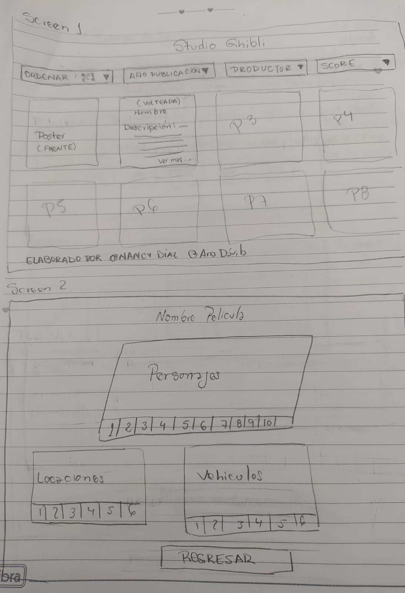
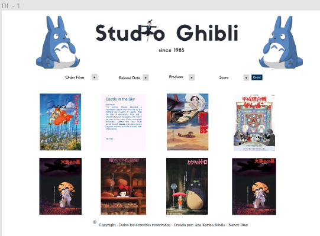
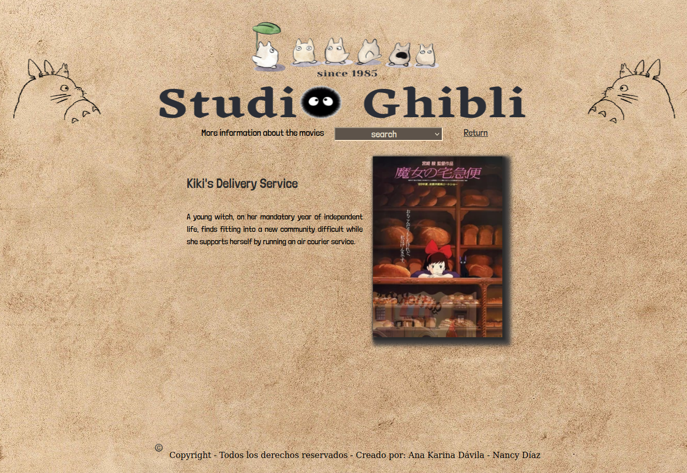

# Data Lovers

## Índice

* [1. Preámbulo](#1-preámbulo)
* [2. Resumen del proyecto](#2-resumen-del-proyecto)
* [3. Objetivos de aprendizaje](#3-objetivos-de-aprendizaje)
* [4. Consideraciones generales](#4-consideraciones-generales)
* [5. Criterios de aceptación mínimos del proyecto](#5-criterios-de-aceptación-mínimos-del-proyecto)
* [6. Hacker edition](#6-hacker-edition)
* [7. Consideraciones técnicas](#7-consideraciones-técnicas)
* [8. Pistas, tips y lecturas complementarias](#8-pistas-tips-y-lecturas-complementarias)
* [9. Checklist](#9-checklist)

***

## 1. Resumen del proyecto Studio Ghibli.

En este proyecto realizaremos una _página web_ para visualizar un
_conjunto (set) de datos_** que, por medio de nuestra investigación, los usuarios necesitan visualizar.

Como entregable final tendremos una página web que permita **visualizar la data, filtrarla y ordenarla**.

## 2.¿Quiénes son los principales usuarios de producto?

1. Aficionados de los films de Studio Ghibli.
2. Interesados en conocer datos importantes de nosotro.
## 3. ¿Cuáles son los objetivos de estos usuarios en relación con el producto?

Conocer cuántas y cuales son los films creados y la informacion de cada uno, entre ella, personajes, vehiculos, locaciones, directores y productores.

## 4. ¿Cuáles son los datos más relevantes que quieren ver en la interfaz y por qué?

Tomando de referencia  los nombres de los films mostraremos lo siguiente:
1. Poster.
2. Datos del director y productor.
3. Descripción.
4. Año de publicación.
5. Ranking.
6. Personajes.

## 5. ¿Cuándo utilizan o utilizarían el producto?

Para informarse de todo lo que nos ha proporcionado el Estudio Ghibli, curiosidades, datos y más.

## 6. Historias de usuario.

 1. Historia de usuario 1: Filtrar las peliculas    
    Como: usuario online
    Quiero: Filtrar las peliculas, así como también sus personajes, locaciones y vehículos de cada films.
    Para:  Saber datos importantes sobre las peliculas de Studio Ghibli.
* Criterios de aceptación:
  1. Poder filtrar por productores.
  2. Poder ordenar por release data.
  3. Poder ordenar de manera ascendente y descendente los titulos de las peliculas.
  4. La pagina debe ser responsive.
* Definicion de terminado:
  1. Pasar todas las pruebas.
  2. Debe estar actualizada en el repositorio.

2. Historia de usuario 2: Conocer información de los personajes, Vehiculos y locaciones de los films.
Como: Fanatica de Studio Ghibli.
Quiero: Poder seleccionar los personajes.
Para: Saber conocer sus caracteristicas.
* Criterios de aceptación:
  1. El usuario debe seleccionar  el poster de la pelicula que desea conocer y visualizara el titulo y la descrpcion y a su vez un enlace a ver mas contenido.
  2. El usuario podra filtrar por personajes, vehiculos y locaciones.
  3. La pagina debe ser responsive.
* Definicion de terminado:
  1. Pasar todas las pruebas.
  2. Debe estar actualizada en el repositorio.

## 7. Diseño de la Interfaz de Usuario.

1. Selección de films de Estudio Ghibli.
2. Filtrado de data.
3. Visualización de data.

## 8. Prototipo de baja fidelidad

Sketches.
Primera Iteración.  Opciones: 
 
 
Segunda Iteración. 
 

## 9. Prototipo de alta fidelidad
Opciones: 
 
 
 
 

## 10. Diseño final del proyecto:
El diseño de la página, luego de solicitar varios feedback, nuestro resultado fue el siguiente:
 
 
 
