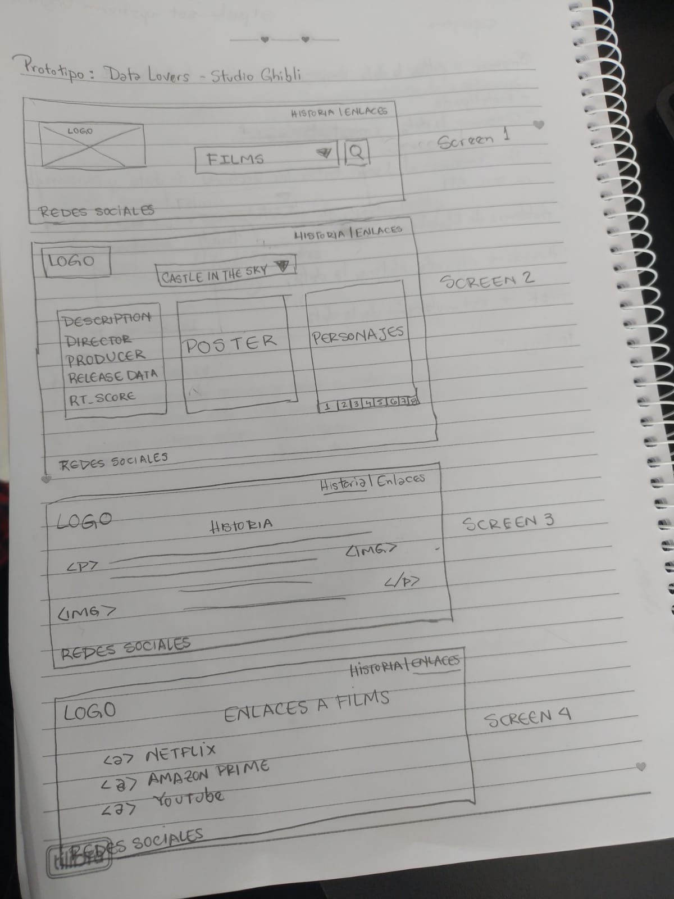

# Data Lovers

## Índice

* [1. Resumen del proyecto Studio Ghibli](#2-resumen-del-proyecto-Studio-Ghibli)
* [2. ¿Quiénes son los principales usuarios de producto?](#2-quiénes-son-los-principales-usuarios-de-producto)
* [3. ¿Cuáles son los objetivos de estos usuarios en relación con el producto?](#3-cuáles-son-los-objetivos-de-estos-usuarios-en-relación-con-el-producto)
* [4. ¿Cuáles son los datos más relevantes que quieren ver en la interfaz y por qué?](#4-cuáles-son-los-datos-más-relevantes-que-quieren-ver-en-la-interfaz-y-por-qué)
* [5. ¿Cuándo utilizan o utilizarían el producto?](#5-cuándo-utilizan-o-utilizarían-el-producto)
* [6. Historias de Usuario](#6-historia-de-usuario)
* [7. Diseño de la Interfaz de Usuario.](#7-diseño-de-la-interfaz-de-usuario)
* [8. Prototipo de baja fidelidad](#8-prototipo-de-baja-fidelidad)
* [9. Prototipo de alta fidelidad](#9-prototipo-de-alta-fidelidad)

***

## 1. Resumen del proyecto Studio Ghibli.

En este proyecto realizaremos una _página web_ para visualizar un
_conjunto (set) de datos_** que, por medio de nuestra investigación, los usuarios necesitan visualizar.

Como entregable final tendremos una página web que permita **visualizar la data, filtrarla y ordenarla**.

## 2.¿Quiénes son los principales usuarios de producto?

1. Aficionados de los films de Studio Ghibli.
2. Interesados en conocer datos importantes de nosotro.
## 3. ¿Cuáles son los objetivos de estos usuarios en relación con el producto?

Conocer cuántas y cuales son los films creados y la informacion de cada uno, entre ella, personajes, vehiculos, locaciones, directores y productores.

## 4. ¿Cuáles son los datos más relevantes que quieren ver en la interfaz y por qué?

Tomando de referencia  los nombres de los films mostraremos lo siguiente:
1. Poster.
2. Datos del director y productor.
3. Descripción.
4. Año de publicación.
5. Ranking.
6. Personajes.

## 5. ¿Cuándo utilizan o utilizarían el producto?

Para informarse de todo lo que nos ha proporcionado el Estudio Ghibli, curiosidades, datos y más.

## 6. Historias de usuario.

 1. Historia de usuario 1:
 2. Historia de usuario 2:
 3. Historia de usuario 3: 

## 7. Diseño de la Interfaz de Usuario.

1. Selección de films de Estudio Ghibli.
2. Filtrado de data.
3. Visualización de data.

## 8. Prototipo de baja fidelidad

Sketches.
Primera Iteración. 
1. Opción 1: 
 
2. Opcion 2: 
 

## 9. Prototipo de alta fidelidad

